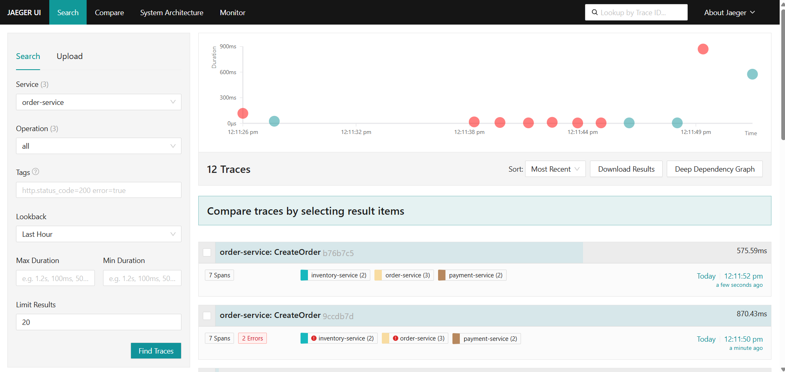
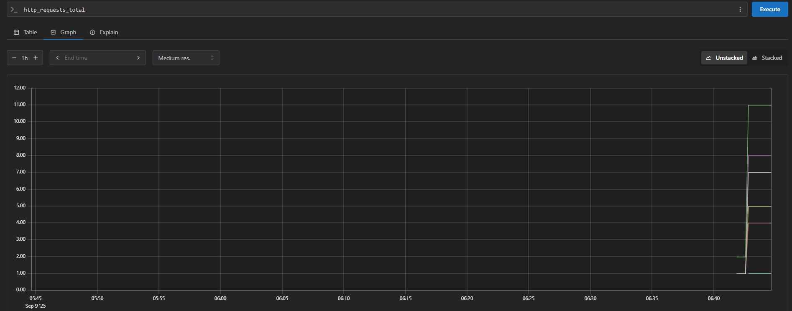
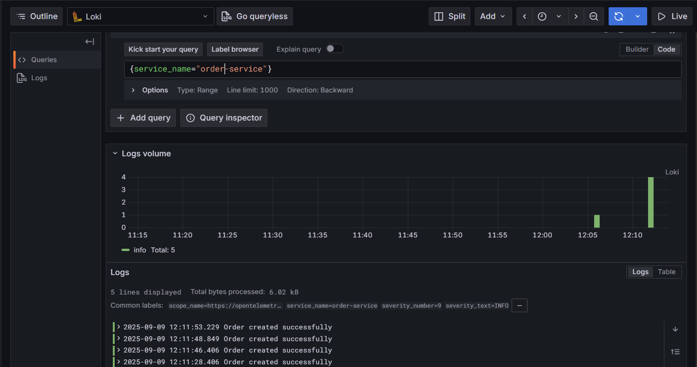
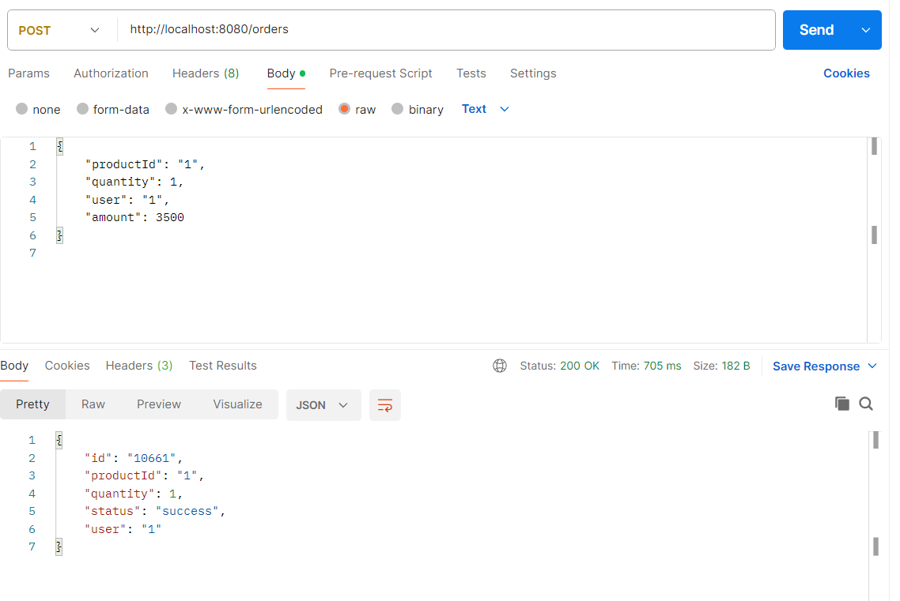

# Telescope - Observability with OpenTelemetry 🚀
This project demonstrates a full-stack observability solution for a microservices architecture using OpenTelemetry. It consists of three primary services: an Order Service, an Inventory Service, and a Payment Service, all instrumented to generate traces, metrics, and logs.
# Project Description
This project showcases how to implement end-to-end observability in a microservices environment. We use Docker and Docker Compose to manage the services and the observability backend. The services are instrumented using the OpenTelemetry SDKs, which allows them to emit telemetry data (traces, metrics, and logs) to otel collector. The collector then exports this data to a backend (like Jaeger for traces, Prometheus for metrics, and Grafana Loki for logs) for visualization and analysis.
# Features
* Distributed Tracing: Trace requests across multiple services to understand the flow and pinpoint performance bottlenecks.

* Metrics Monitoring: Collect key performance indicators (KPIs) like request latency, error rates, and resource utilization for each service.

* Structured Logging: Centralize and correlate logs with traces to simplify debugging and incident response.

* Dockerized Environment: All services and the observability stack are containerized for easy setup and portability.
# Getting Started
Follow these steps to get the project up and running locally.

### 1. Clone the repository:
```
git clone https://github.com/AnmolxSingh/Tele-Scope.git
cd Tele-Scope
```
### 2. Start the services:

Use Docker Compose to build and run all the services and the observability stack.
```
docker-compose up --build -d
```
This command will start all the services listed in docker compose file.

### 3. Access the dashboards:

Once all containers are running, you can access the observability dashboards at the following URLs:

* Jaeger UI (Tracing): http://localhost:16686



* Prometheus UI (Metrics): http://localhost:9090



* Grafana UI (Dashboards): http://localhost:3000



### 4. Send test requests:

Use a tool like  Postman to send requests to the order-service and generate traces and metrics.



# Observability Stack

This project uses the following components for observability:

* OpenTelemetry Collector: Acts as an intermediary to receive, process, and export telemetry data.

* Jaeger: A distributed tracing system used to visualize traces and debug microservice transactions.

* Prometheus: A powerful monitoring and alerting toolkit for collecting metrics.

* Grafana: The open-source platform for data visualization and analytics, used to build dashboards for metrics and logs.

* Loki: A log aggregation system from Grafana, designed to be cost-effective and easy to operate.

# License

This project is licensed under the MIT License.